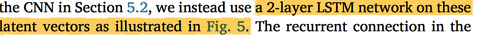
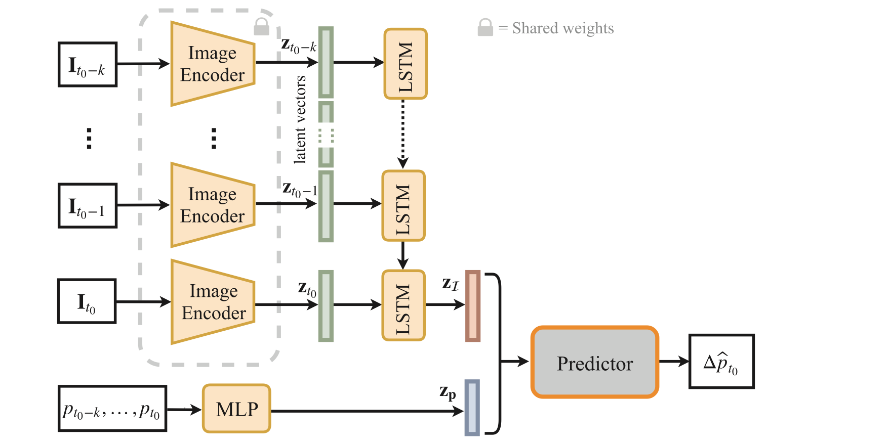

# 1. sample note

## 1.1 sample structure

1.Summary of Proposal

​	1.1. Project Specification

​	1.2Changes to Original Specification

​	1.3. Research and Analysis Done

2.Algorithm Design

​	2.1. Algorithm Structure (flow chart)

​	2.2 - 2.x Algorithm Specification

3.Evaluation Design

4.Project Plan Review

Reference

Appendix:(project schedule)

---

# 2.Reference

### 2.1 Deep photovoltaic nowcasting

**Abstract**.

historical photovoltaic power values and sky images as **input**

<u>estimate</u> **photovoltaic power** in a very short term future.

compare **three** different architectures: MLP, LSTM, CNN

**chanllenge**: cloud dynamics—including variations in shape, appearance, velocity, direction

1.

<u>bypass</u> having to explicitly model cloud movement using traditional image processing techniques as was done in the previous work.

<u>train</u> algorithms that automatically learn the **relationship** between the **sky appearance** (including clouds, sun, clear sky, etc.) and the photovoltaic **power output** of a solar panel.

2.

**data-driven method**s have been widely used as “**black/ gray-box**” models for short term solar

modeling cloud is one of their challenging problem.

do not rely on explicit image processing techniques, rather we automatically learn how cloud motion and sky appearance translate into future photovoltaic power production

**cnn**: can also be used for forecasting tasks from historical data.(Villegas et al. (2017) build a model with **a combination of LSTM and encoder-decoder CNNs**, which generate future frames from historical image sequences.)

3.

**data:** a large dataset of hemispherical HDR sky images and corresponding photovoltaic power. 90 days were used for the experiments reported in this paper.These 90 days were randomly sampled from the 1.5 year time period and cover different seasons.

data **filter**: remove data image is invalid(too dark), or photovoltaic power output is 0 (below sensitivity threshold).

5.Deep learning architectures to predict photovoltaic production

5.2cnn

can use previous images I associated to each p ∈ p .

5.3. LSTM for modeling temporal information

### 2.2 Battery-Less Short-Term Smoothing of Photovoltaic Generation Using Sky Camera

1.

**BS-based** solutions have become more prevalent due to recent improvements in performance

In this paper,an averaged cloud prediction approach

### 2.3 Validation of an all‐sky imager–based nowcasting system for industrial PV plants

Abstract:ound that spatial and temporal aggregations significantly improve forecast accuracies:

1.

aim

2.

If a pixel in the image under consideration is clouded, its RGB values deviate from the CSL, and this way a **cloud is detected**.

### 2.4 Accurate photovoltaic power forecasting models using deep LSTM-RNN

the use of long short-term memory recurrent neural network (LSTM-RNN) to accurately forecast the output power of PV systems.

We used different LSTM models for the purpose of specifying the model that gives the most accurate results with each PV dataset.

---

[雷达图像的短期降水预报](https://zhuanlan.zhihu.com/p/79451349)