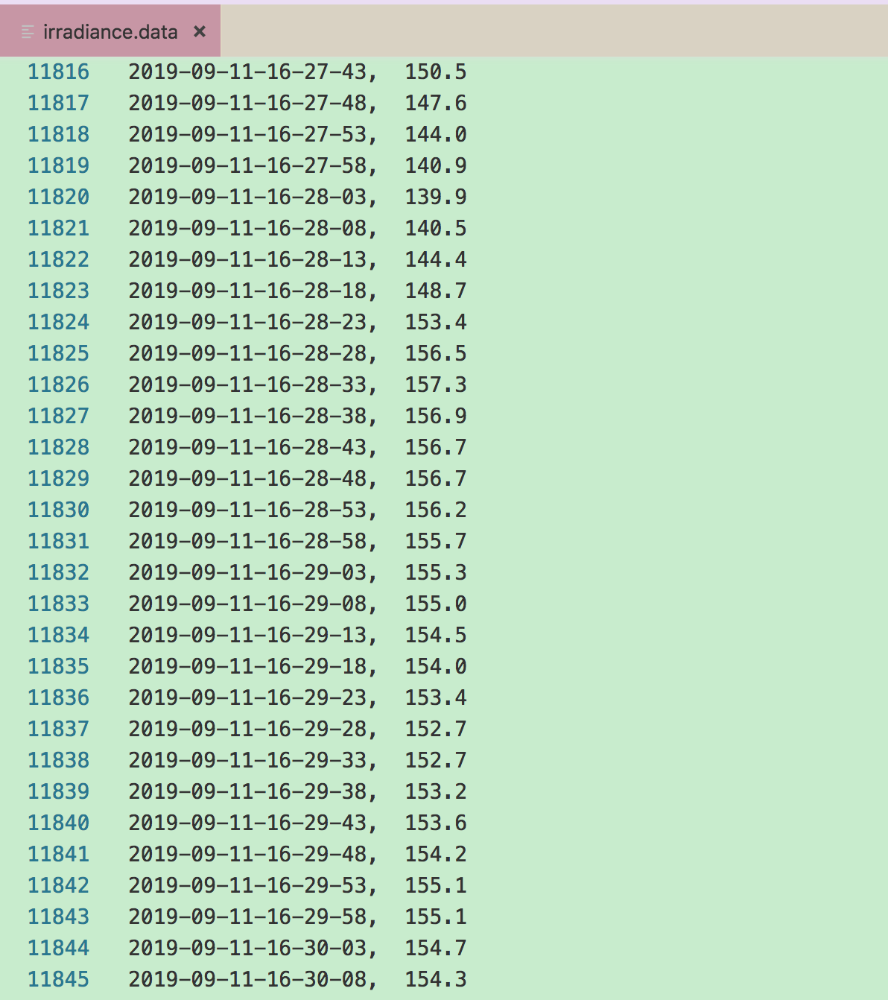

[TOC]

## 步骤

1. 读取raw data

2. 转换为feature label 在同一行的形式,生成一个新的

   记录的图像开始从08:00,对应的是第5740行

   ​					结束至17:00,对应的是第12203行
   
3. 求平均值

4. add 层的输入是一个list

5. 

     

     


## 1.raw data

 


```python
#!/usr/bin/python
# -*- coding: UTF-8 -*-

import numpy as np

filename = '/Users/hyc/github/learning/dissertation/code/PVdata/irradiance.data'  # txt文件和当前脚本在同一目录下，所以不用写具体路径
pos = []
Efield = []
with open(filename, 'r') as file_to_read:
    while True:
        lines = file_to_read.readline()  # 整行读取数据
        if not lines:
            break
            pass
        #p_tmp, E_tmp = [float(i) for i in lines.split(",  ")]  # 将整行数据分割处理，如果分割符是空格，括号里就不用传入参数，如果是逗号， 则传入‘，'字符。
        E_tmp =  float(lines.split(",  ")[1])
        #pos.append(p_tmp)  # 添加新读取的数据
        Efield.append(E_tmp)
        pass
#pos = np.array(pos)  # 将数据从list类型转换为array类型。
Efield = np.array(Efield)
pass

#结果
Efield

array([0.1, 0. , 0.1, ..., 0. , 0. , 0. ])
```


---

## Difficulty

### 1.怎么可以使mlp层中的输入数据对应cnn的输入数据?


---

## 个人总结

### 1.Python中的list与NumPy中array的区别

Python中的list是python的内置数据类型，**list中的数据类不必相同的**。

在list中的数据类型保存的是数据所存放的地址，简单的说就是**指针**，并非数据，这样保存一个list就太麻烦了，例如list1=[1,2,3,'a']需要4个指针和四个数据，增加了存储和消耗cpu。


Numpy中的**array**所存放的**数据类型必须全部相同**。


### dataframe

1. 从csv读出数据的格式是dataframe

```python
# load dataset
dataframe = pandas.read_csv("/Users/hyc/github/learning/dissertation/code/keras_regression_house/housing.data", delim_whitespace=True, header=None)
dataset = dataframe.values
# split into input (X) and output (Y) variables
X = dataset[:,0:13]
Y = dataset[:,13]

type(dataframe)

pandas.core.frame.DataFrame
```

2. dataframe 转 array

```python
dataset = dataframe.values
type(dataset)

numpy.ndarray
```


## 2.模型融合用add()

**keras.layers.add()和keras.layer.conatenate()**

- **add**对张量执行求和运算
  **concatenate**对张量进行串联运算

[link](https://blog.csdn.net/LiQingBB/article/details/84935478)